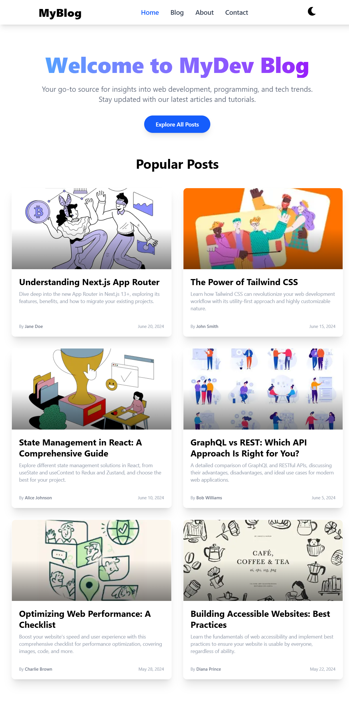

# 📝 Blog Next.js

A minimalist blog built with **Next.js 13 App Router** and **Tailwind CSS**, featuring dynamic routes, light/dark mode, and a glowing mouse-tracking effect.  
👉 [Live Site](https://blog-next-js-beige.vercel.app/)

---

## ✨ Features

- 🧭 Dynamic routing via `/blog/[slug]`
- ⚡ Static Site Generation (SSG) using `generateStaticParams`
- 💅 Tailwind CSS styling
- 🌙 Light & Dark mode support (auto-switches with system)
- 🐭 Mouse trail effect (glowing blue circle follows cursor)
- 📦 Optimized with Next.js `Image` component
- 🧱 Clean component structure for scalability
- ❌ Custom 404 page for invalid slugs

---

## 📸 Screenshots

Light & dark themes + mouse effect demo:

| Light Mode                                                            | Dark Mode                                                           |
| --------------------------------------------------------------------- | ------------------------------------------------------------------- |
|  | .png) |

The site layout in action:

.png>)
.png>)
.png>)
.png>)


---

## 📁 Folder Structure

```
blog-next-js/
├─ app/
│  ├─ blog/
│  │  ├─ [slug]/
│  │  │  └─ page.tsx       # Individual blog page
│  └─ layout.tsx           # Main app layout
├─ public/                 # Static assets & screenshots
├─ styles/                 # Tailwind & global styles
├─ tailwind.config.js      # Tailwind configuration
├─ next.config.js          # Next.js configuration
└─ README.md               # You're here!
```

---

## 🚀 Getting Started

### 1. Clone the repo

```bash
git clone https://github.com/Nishant-Kumar-devz/blog-next-js.git
cd blog-next-js
```

### 2. Install dependencies

```bash
npm install
# or
yarn
```

### 3. Run locally

```bash
npm run dev
```

Visit [http://localhost:3000/blog](http://localhost:3000/blog)

### 4. Build for production

```bash
npm run build
npm start
```

---

## 🧩 Customization Tips

| Task             | How                                        |
| ---------------- | ------------------------------------------ |
| Add new post     | Add to `blogPosts` array inside `page.tsx` |
| Use external CMS | Replace dummy data with API/CMS calls      |
| Customize styles | Edit `tailwind.config.js` or add classes   |
| Improve SEO      | Add `generateMetadata` in blog pages       |

---

## 🛠 Deployed on Vercel

Click to view or fork:

[](https://vercel.com/new/project?template=next.js/blog-nextjs-sanity)

---

## 🧰 Built With

- [Next.js 13 App Router](https://nextjs.org/docs/app)
- [Tailwind CSS](https://tailwindcss.com/)
- [React 18](https://reactjs.org/)
- [Vercel](https://vercel.com/)

---

## 🤝 Contributing

1. Fork the project
2. Create your branch (`git checkout -b feature/your-feature`)
3. Commit your changes
4. Push and open a Pull Request

---

## 📄 License

This project is open-source and available under the [MIT License](LICENSE).

---

### ✨ Happy Blogging with Next.js & Tailwind!
